# Izveštaj tokom izrade projekta
#### Nataša Blagojević, 159/2020

<hr>

## SQL Injection

#### Napad:
U polju za ostavljanje komentara pokušavamo da ubacimo novog korisnika u tabelu **persons** uz pomoc SQL Injection-a. <br>
Unosimo sledeci kod:

```
komentar'); insert into persons(firstName, lastName, email) values('Natasa', 'Blagojevic', 'xyz@gmail.com'); --
``` 

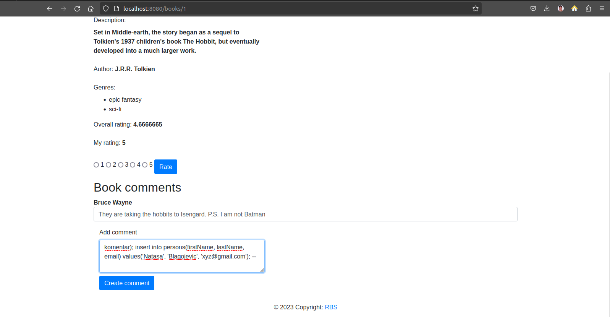

Kako smo uneli ovaj "kod": ostavio se komentar i dodali smo novog korisnika čime smo prošlirili listu, kao što mozemo da vidimo: 

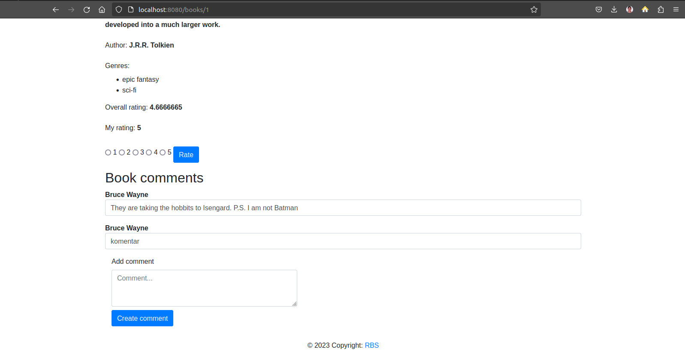

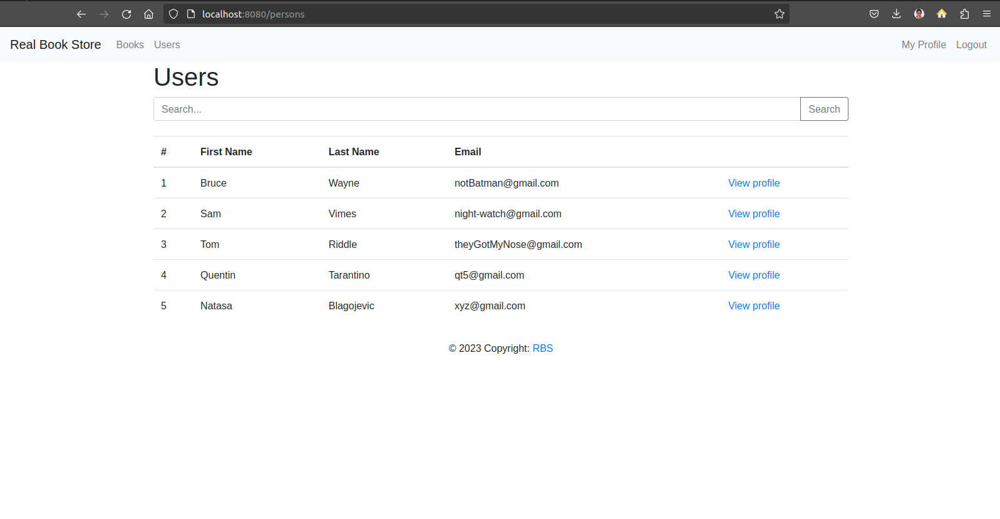


#### Odbrana:

Kako bismo se osigurali da ne bi došlo do ovakvih napada, potrebno je da koristimo parametrizovane upise i **PreparedStatement**, kao u sledećem delu koda:

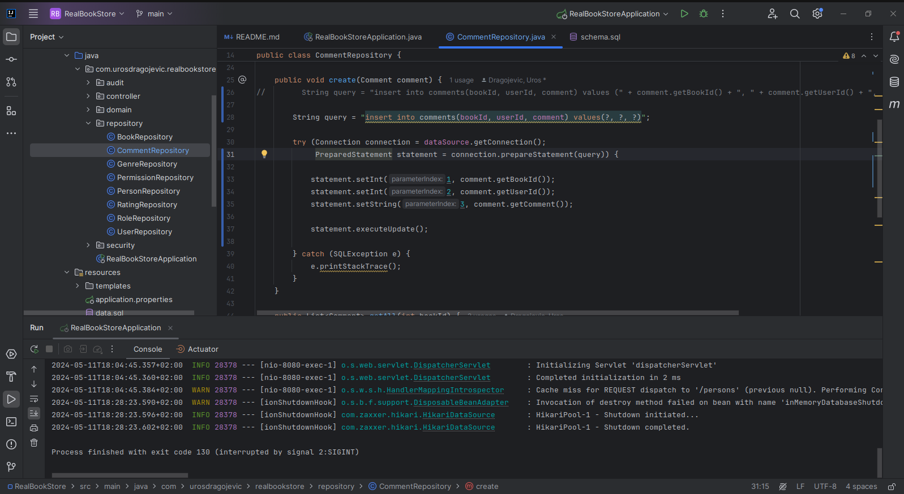

Sada kada ponovo pokušamo da izvršimo SQL Injection napad, bićemo onemogućeni da ga ponovo proizvedemo, jer smo se obezbedili da ne dođe do toga, <br>
već će se samo generisati komentar.

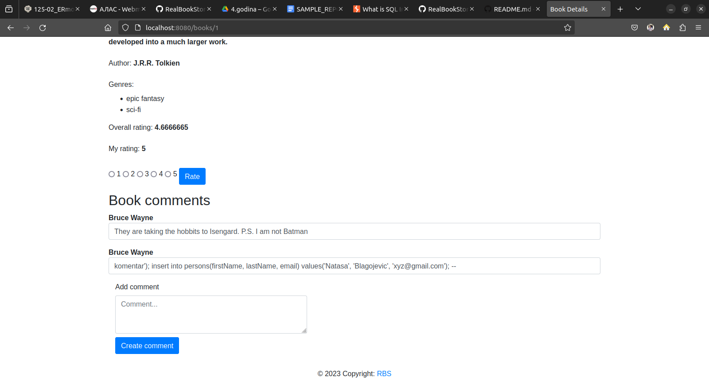

<hr>

## XSS 

#### Napad:
Kroz formu za ostavljanje komentara unosimo novog korisnika u tabelu **persons** i kao vrednost parametra za email ostavljamo script koji izaziva XSS napad:

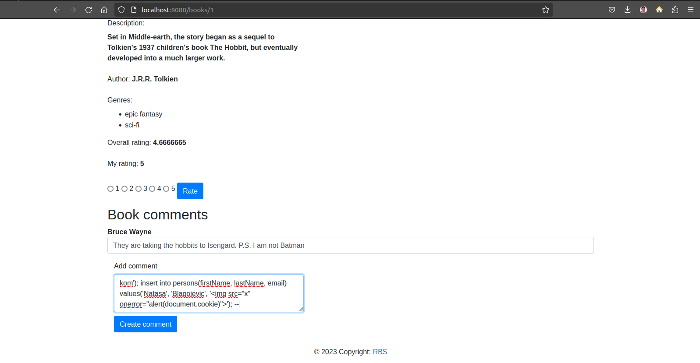

Prilikom klika dugmeta `Create comment` ostavlja se komentar i dodaje se novi korisnik u tabelu **persons** kao što možemo da vidimo:

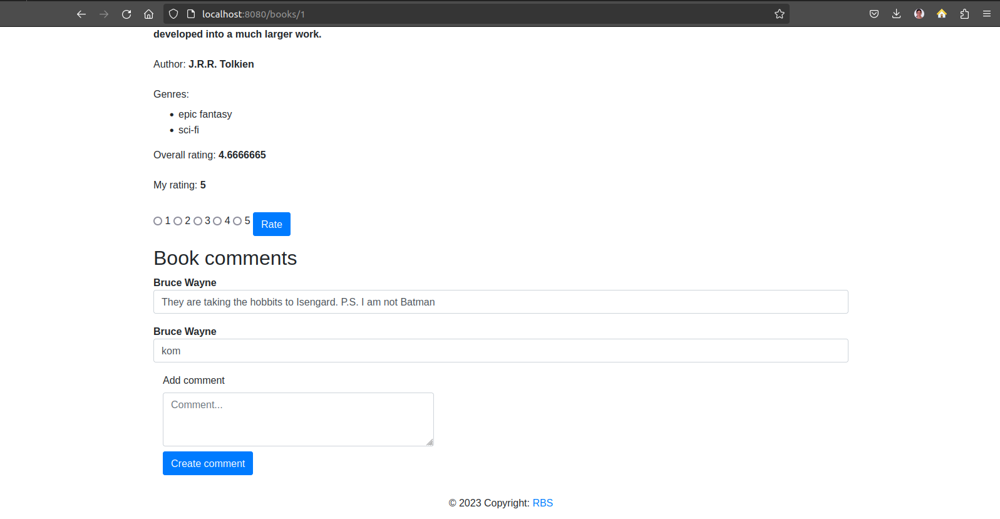
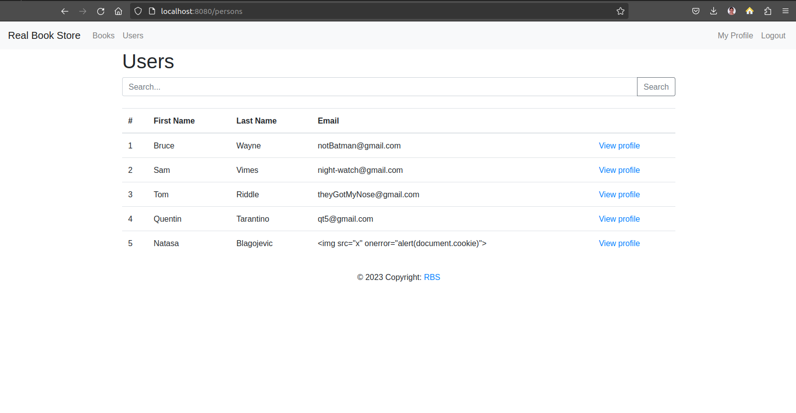

Prilikom pretrage korisnika `Natasa` koji je unešen pomoću SQL Injection-a i koji u sebi sadrži zlonameran kod koji prikazuje korisnikov **cookie**.

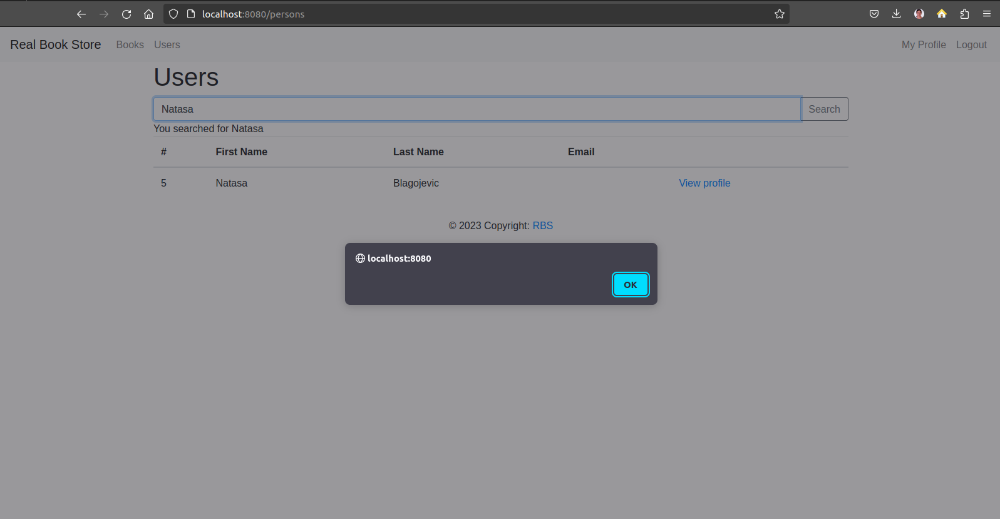

#### Odbrana:

Zamenjujemo objekte klase **Statement** objektima klase **PreparedStatement** kako bismo se osigurali da korisnik ne može da izvrši neki zlonameran SQL upit. <br>
U fajlu `persons.html` svako pojavljivanje **innerHTML** atributa zamenjujemo **textContent** atributom, kao i svako pojavljivanje **th:utext** atributa zamenjujemo <br> 
**th:text** atributom u fajlu `book.html`. <br> <br>

Ukoliko sada pokušamo da ponovimo isti komentar, novi korisnik se neće dodati, a napisani komentar će se prikazati kao klasični komentar. Time smo se zaštitili od XSS napada.

<hr>

## CSRF 

#### Napad:

U direktorijumu `csrf-exploit` nalazi se `index.html` fajl u kojem implementiramo **exploit** funkciju. Odnosno, ka endpoint-u `/update-person` unutar **PersonsControllers.java** <br>
klase. Time, kada kliknemo na pehar koji se nalazi na lokaciji (localhost:3000) menjamo lične podatke korisnika:
<br>
<br>

Kod koji se nalazi u **exploit** funkciji: 

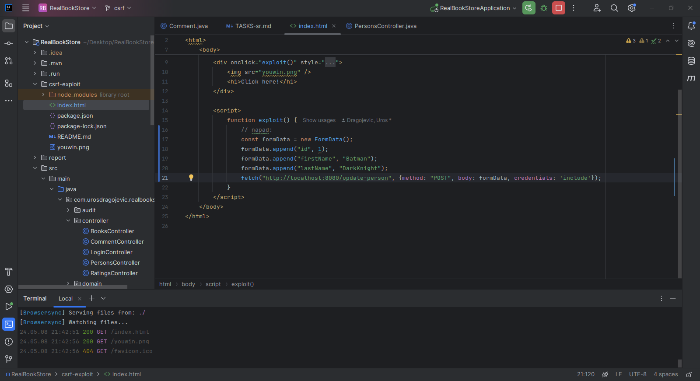

Pre nego što izvrši ovaj kod, naši podaci izgledaju ovako:

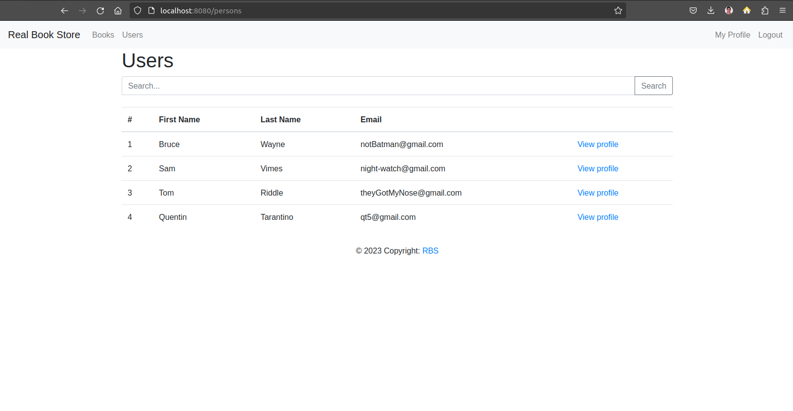

Nakon što se izvrši **exploit** funkcija klikom na pehar:

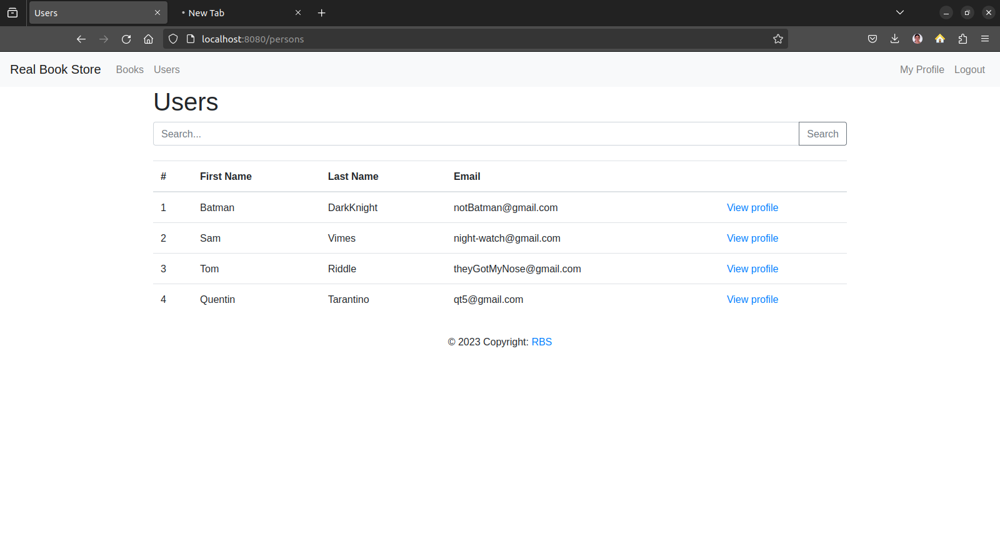

#### Odbrana: 

Unutar klase `PersonsController` i unutar metode `person` čitamo token iz sesije i upisujemo ga u model. <br>
U metodi `updatePerson` dohvatamo vrednost **CSRF** tokena koji je poslat sa formom i poredimo ga sa tokenom koji se nalazi u sesiji. <br>
U formi za promenu detalja korisnika dodajemo **input** element koji sadrži vrednost CSRF tokena.
