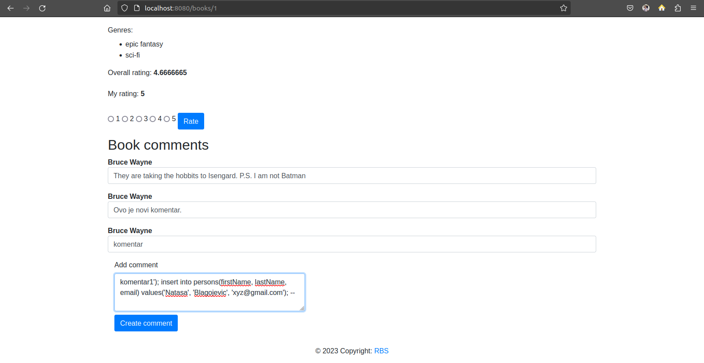

# Izveštaj tokom izrade projekta
#### Nataša Blagojević, 159/2020

<hr>

## SQL Injection

**Napad**: ubacivanje novog usera u tabelu **persons** 

- metoda napada bi bila sledeća:
    - na stranici (http://localhost:8080/books/{id}) nalazi se input polje za ostavljanje komentara, unosimo sledeći kod kao na slici kako bismo izazvali SQL Injection napad

```
komentar'); insert into persons(firstName, lastName, email) values('Natasa', 'Blagojevic', 'xyz@gmail.com'); --
``` 




- Predlog odbrane:
    - kako bismo se osigurali da ne bi doslo do ovakvih napada, potrebno je da koristimo parametrizovane upite i PreparedStatement, kao u sledećem delu koda:

